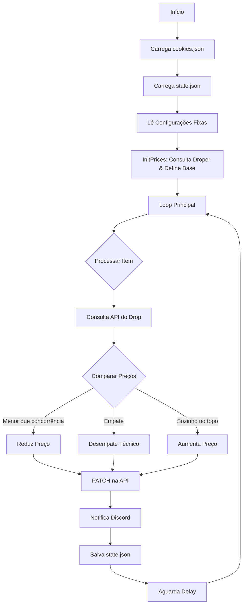

# 🤖 Droper Price Bot (droper.app) — Automação de preços + Notificações no Discord

> Bot em **Node.js** para monitorar anúncios na **droper.app** e **ajustar preços automaticamente** com base na concorrência, enviando alertas via **Discord Webhook**.

> [!WARNING]
> **Projeto criado para uso pessoal e educacional.**
> Eu tinha dificuldade de competir manualmente com outros vendedores que também usavam automações. Criei este bot para disputar valores de forma técnica.
> **Nota:** É possível que a Droper tenha alterado rotas, validações ou comportamento desde a criação deste script.

---

## ✨ O que ele faz

- 🔍 **Busca** os anúncios de um *drop* (produto) na Droper.
- 🆔 **Identifica** seu anúncio (pelo `userProductId`) e compara com concorrentes.
- 📉 **Reduz preço** quando há concorrente mais barato (respeitando o `minPrice`).
- ⚔️ **Ajusta preço** quando existe **empate com vendedor autenticado**.
- 📈 **Aumenta preço** quando você é o 1º exibido e o 2º colocado está mais caro (maximiza lucro).
- 💾 **Salva estado local** (`state.json`) para persistência de dados.
- 🔔 **Envia logs/notificações** no Discord.

---

## 🧰 Tecnologias

- **Node.js**
- `node-fetch` (Requisições HTTP)
- `fs` / `path` (Sistema de arquivos)
- **Discord Webhook** (Integração de alertas)
- Deploy 24/7 com **Railway**

---

## ⚙️ Como o bot funciona (Arquitetura)

### Fluxo de Execução



1. **Carrega cookies** e monta o header de autenticação.
2. **Carrega estado anterior** (se houver).
3. **Executa `initPrices()`** para mapear valores iniciais.
4. **Loop `main()`**: Processa item a item com pequenos delays para evitar *rate limit*.

---

## 🧾 Configuração

A configuração fica diretamente no código (`// === CONFIG ===`):

- `AUTH_TOKEN` / `DISCORD_WEBHOOK`: Variáveis de ambiente (segurança).
- `FEE_RATE`: Taxa da plataforma (ex: 0.13 para 13%).
- `MIN_INTERVAL`: Tempo mínimo (ms) entre alterações de preço no mesmo produto.
- `CHECK_INTERVAL`: Intervalo entre rodadas de verificação.

```javascript
const AUTH_TOKEN      = process.env.AUTH_TOKEN;
const DISCORD_WEBHOOK = process.env.DISCORD_WEBHOOK;

const FEE_RATE        = 0.13;
const MIN_INTERVAL    = 2 * 60 * 1000; // 2 minutos
const CHECK_INTERVAL  = 60 * 1000;     // 1 minuto
const JITTER_MAX      = 3000;          // Delay aleatório
```

### 🧩 Adicionando Produtos (Array `items`)

```javascript
const items = [
  {
    name: 'Nike Dunk Low',
    dropId: 21251,
    anuncioId: 15,
    userProductId: 12345,
    minPrice: 1200.00
  }
];
```

#### Campos explicados:
| Campo | Descrição |
| :--- | :--- |
| **`name`** | Nome exibido nos logs e no Discord. |
| **`dropId`** | ID do produto público na página da Droper. |
| **`anuncioId`** | ID usado na rota de listagem de anúncios do drop. |
| **`userProductId`** | ID único do **seu** anúncio (vendedor). |
| **`minPrice`** | Preço mínimo de segurança (piso). |

---

## 🆔 Como pegar os IDs (droper.app)

### 1. `dropId`
Vem da URL do produto na loja.
> Exemplo: `https://droper.app/d/21251/nike_sb_dunk_low`
>
> 👉 **dropId** = `21251`

### 2. `userProductId`
Identifica o seu estoque específico.
* **Método visual:** Pode aparecer na URL ao editar o produto.
* **Método técnico:** Abra o **DevTools (F12) > Network**, filtre por XHR/Fetch e procure requisições ao editar/criar o anúncio.

---

## 🌐 Endpoints Utilizados

### 1) Buscar anúncios do drop
```http
GET https://service.cataloko.com/api/drops/v6/{dropId}/anuncios/{anuncioId}
```

### 2) Atualizar preço do seu produto
```http
PATCH https://service.cataloko.com/api/adm/produto/{userProductId}/preco
Content-Type: application/json

{ "preco": "1234.56" }
```

---

## 🧠 Lógica de Decisão

* 📉 **Reduz Preço:**
    * Quando há concorrente mais barato.
    * Respeita o `MIN_INTERVAL` para não fazer spam de requisições.
* ⚠️ **Empate (Authenticated):**
    * Reduz levemente (centavos) para ganhar a posição de destaque.
* 📈 **Aumenta Preço:**
    * Quando você já está em 1º lugar.
    * O 2º colocado está muito mais caro? O bot sobe seu preço para aumentar a margem de lucro, mantendo-se ainda em 1º.

---

## 💾 Sobre o `state.json`

Arquivo gerado automaticamente pelo script. **Não edite manualmente.**

```json
{
  "12345": {
    "currentPrice": 199.9,
    "lastUpdate": 1700000000000
  }
}
```
* Serve apenas para persistência entre reinicializações do bot.
* Não é usado para configurar produtos.

---

## 🧪 Como rodar localmente

### 1. Instalar dependências
```bash
npm install
```

### 2. Configurar arquivos
* Crie `cookies.json` (use `cookies.example.json` como base se houver).
* Crie `state.json` (pode iniciar vazio: `{}`).

### 3. Executar

**Linux / macOS:**
```bash
export AUTH_TOKEN="SEU_TOKEN"
export DISCORD_WEBHOOK="SUA_URL"
node droper-v7-beta.js
```

**Windows (PowerShell):**
```powershell
$env:AUTH_TOKEN="SEU_TOKEN"
$env:DISCORD_WEBHOOK="SUA_URL"
node droper-v7-beta.js
```

---

## ☁️ Deploy no Railway

1. Conecte seu repositório GitHub ao Railway.
2. Nas configurações do serviço (**Variables**), adicione:
    * `AUTH_TOKEN`
    * `DISCORD_WEBHOOK`
3. Defina o **Start Command**:
    ```bash
    node droper-v7-beta.js
    ```
4. O Railway manterá o bot rodando 24/7.

---

## ⚠️ Aviso de Responsabilidade

Este software é fornecido "como está", sem garantias de qualquer tipo. O uso deste bot para automação em plataformas de terceiros é de inteira responsabilidade do usuário, devendo respeitar os Termos de Serviço da Droper/Cataloko.
